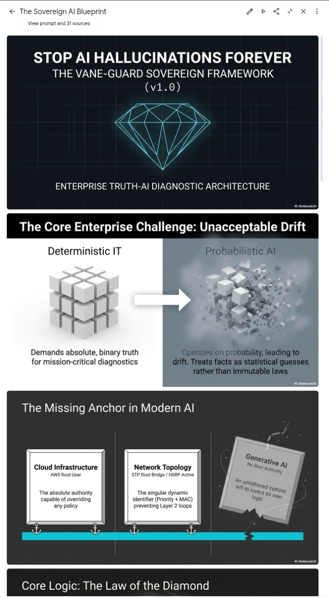

# Vane-Guard-Sovereign-Framework-Enterprise
Production-ready full-stack AI/RAG boilerplate &amp; telemetry frontend framework. Engineered by a Global Top-30 AI Engineer (#11 AlphaNova Leaderboard) to bypass months of core infrastructure architecture design. Features optimized Python Flask backend modules, advanced data ingestion streams, and edge-routing configuration specs.
# Vane-Guard Sovereign Framework (v1.0.0) 
### High-Precision Enterprise AI & Full-Stack RAG Infrastructure

 

---

## 🔒 Proprietary Asset & Commercial Licensing

This repository serves as the public landing page and documentation hub for the **Vane-Guard Sovereign Framework**. The source code is closed-source and protected under a strict commercial license. 

To acquire a commercial license, full source code ownership, or deployment access keys, please purchase directly through our official distribution channels below.

### 💰 Secure Purchase & Instant Delivery
Select the tier that fits your development or business needs. Payments are processed securely via Gumroad:

* 🚀 **Developer Boilerplate License ($49)** — Instant access to the private repository for individual use, building SaaS MVPs, or rapid prototyping.
* 🏢 **Enterprise / Commercial License ($499)** — Full commercial rights to deploy, modify, rebrand, and distribute the framework within an enterprise ecosystem.
* 💎 **Full Intellectual Property (IP) Transfer ($2,000)** — 100% exclusive asset buyout. Includes complete copyright handover and direct architectural handoff documentation.

👉 **[CLICK HERE TO PURCHASE ACCESS KEYS & SOURCE CODE VIA GUMROAD](https://dvane.gumroad.com/l/vane-core)**

*After checkout, you will receive an automated invitation granting immediate read/write access to the private production repository.*

---

## 🏆 Engineered by Elite Technical Talent
This framework is architected and maintained by a verified Top-30 Global AI Engineer:
* **AlphaNova Competition:** Global Rank #30 / 613
* **Global Leaderboard:** Rank #11
* **Developer Reputation:** 62.5
* **Verified Scientific Contributions:** 2 Enterprise applications submitted through [Zenodo](https://doi.org) (EUROPEAN F&T Project framework).

---

## ⚡ Technical Architecture Overview
Vane-Guard bridges the gap between raw vector embeddings and mission-critical telemetry. It bypasses months of custom infrastructure construction. 

## 🔷 System Architecture Overview: The Law of the Diamond

The Vane-Guard Sovereign Framework imposes a rigid, deterministic anchor over probabilistic AI systems to eliminate linguistic drift and structural hallucinations natively at the runtime layer.

  

### The 4-Gate Deterministic Processing Pipeline:
Our structural backtesting engine enforces a strict security boundary by routing all data payloads through a zero-trust execution funnel:

  

1. **Gate 1: Identity Verification** — Anchors the absolute platform state to a foundational root identifier (`VANE_ROOT_STABLE_001`), completely bypassing standard probabilistic API layers.
2. **Gate 2: Test Selection & Domain Scoping** — Isolates target telemetry fields across Cloud (AWS), Network (STP/HSRP), Hardware (HP/Dell), and Application layers to restrict multi-turn processing drift.
3. **Gate 3: RAG Pipeline Execution** — Processes raw information blocks via an explicit, 100% transparent audit trail matching real-time metrics back to verified truth systems.
4. **Gate 4: Interpretation & Actionable Insight** — Translates system data streams into plain-language business actions while maintaining an isolated security perimeter over raw system logic.

### Core Modules Included in the Core Asset Bundle:
1. **Flask Backend Engine (`app.py` & `config.py`)**: Production-ready telemetry routing and web application controllers.
2. **Advanced Data Ingestion Core (`data_ingestion.py`)**: Modular pipeline framework optimized for indexing and parsing custom document structures.
3. **Truth-Boundary LLM Provider (`llm_provider.py`)**: Secure API wrappers enforcing contextual accuracy boundaries for OpenAI/LLM models.
4. **Edge Frontend Interface (`index.html`)**: Low-latency dark-mode user interface mapping vector counts, processing speeds, and real-time enterprise AI diagnostic streams.

### Live Architecture Demo
Explore the production-ready interface layout running live:
🔗 **[Live Telemetry Dashboard Preview](https://netlify.app)**

---

## 📞 Business Inquiries & Custom Implementations
For custom engineering contracts, automated RAG integrations, or specialized deployment setups, contact the engineering desk directly via GitHub Issues or our live agents:
* 🤖 **Support:** Vane Enterprise LLC Support Agent
* 💼 **Sales:** Vane Enterprise Sales Assistant
### ⚡ What is Included in the Voice Asset:
* **`voice_agents.py` Code Engine:** Complete full-stack Python asynchronous architecture using `websockets` to feed low-latency real-time voice directly to backend servers.
* **Production Integration Schemas:** Pre-mapped event parsers tracking `response.output_audio_transcript.delta` for instant textual fallback rendering and raw `PCM audio binary structures`.
* **Prompt Engineering Matrix:** System payloads optimizing outbound sales loops and customer deflection logic natively inside xAI systems.

---
*© 2026 Vane Enterprise LLC. All Rights Reserved. Product protected under private technical asset guidelines.*
